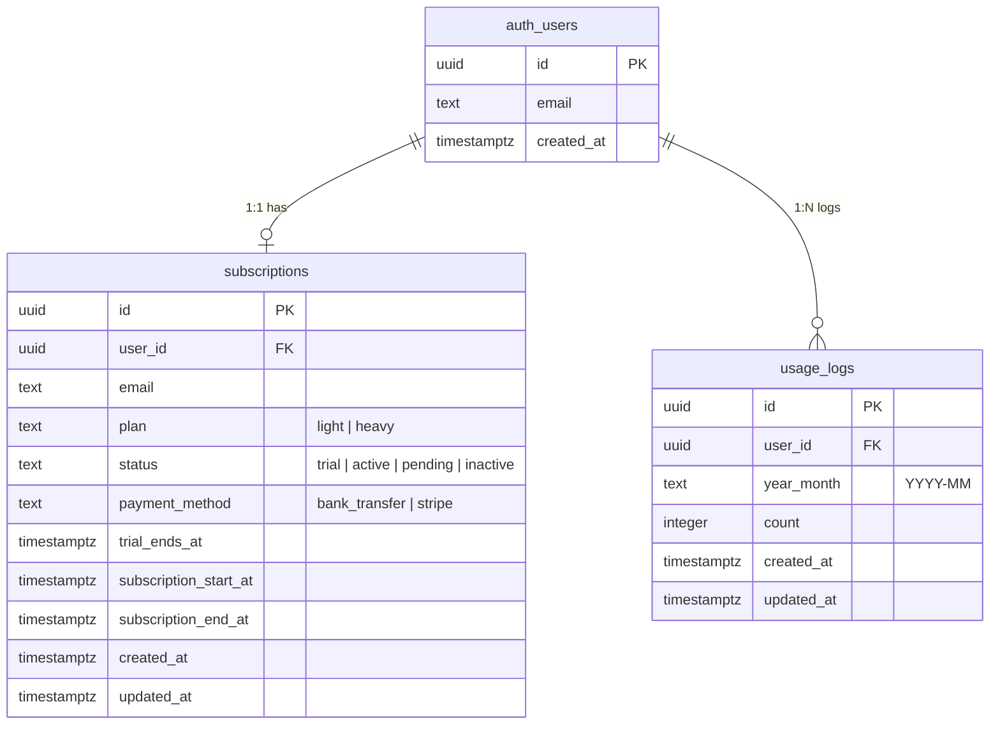
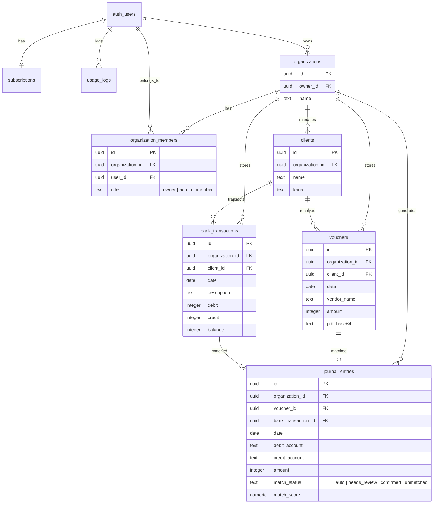
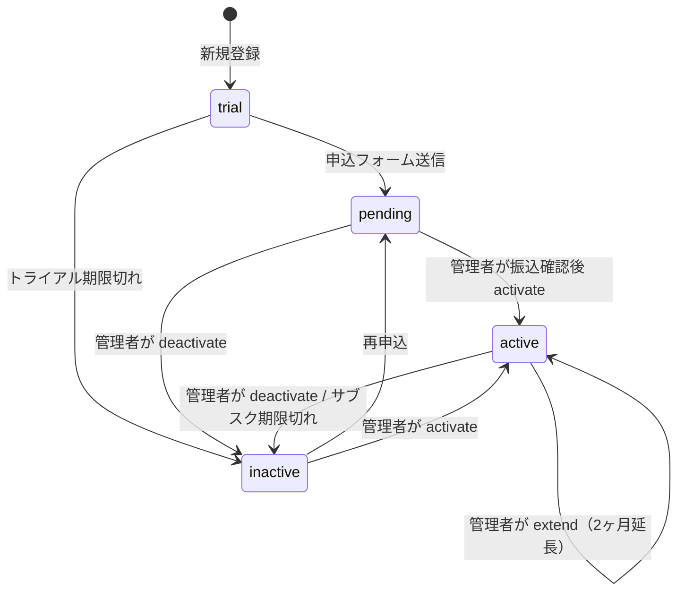

# DB設計書 — Invoice OCR

> Supabase（PostgreSQL）のテーブル定義・RLS・インデックス・マイグレーション

---

## 目次

1. [ER図](#er図)
2. [テーブル一覧](#テーブル一覧)
3. [テーブル詳細定義](#テーブル詳細定義)
4. [Row Level Security (RLS)](#row-level-security-rls)
5. [インデックス](#インデックス)
6. [RPC関数](#rpc関数)
7. [マイグレーションSQL](#マイグレーションsql)
8. [Supabase Auth連携](#supabase-auth連携)
9. [将来のスキーマ拡張計画](#将来のスキーマ拡張計画)

---

## ER図（現行テーブル）



## ER図（将来スキーマ含む全体像）



## サブスクリプション状態遷移図



---

## テーブル一覧

| テーブル名 | 説明 | 現在の状態 |
|-----------|------|-----------|
| `auth.users` | Supabase管理の認証ユーザーテーブル | 既存（Supabase管理） |
| `subscriptions` | サブスクリプション管理 | **実装済み** |
| `usage_logs` | 月次使用量ログ | **実装済み** |
| `organizations` | 税理士事務所（組織）管理 | 将来実装 |
| `organization_members` | 組織のメンバー管理 | 将来実装 |
| `clients` | 顧客管理 | 将来実装 |
| `vouchers` | 証票（請求書等）管理 | 将来実装 |
| `bank_transactions` | 銀行取引明細管理 | 将来実装 |
| `journal_entries` | 仕訳エントリ管理 | 将来実装 |

---

## テーブル詳細定義

### subscriptions（サブスクリプション）

ユーザーのサブスクリプション状態を管理するメインテーブルです。

```sql
CREATE TABLE subscriptions (
  id                    UUID PRIMARY KEY DEFAULT gen_random_uuid(),
  user_id               UUID NOT NULL REFERENCES auth.users(id) ON DELETE CASCADE,
  email                 TEXT NOT NULL,
  plan                  TEXT NOT NULL DEFAULT 'light'
                          CHECK (plan IN ('light', 'heavy')),
  status                TEXT NOT NULL DEFAULT 'trial'
                          CHECK (status IN ('trial', 'active', 'pending', 'inactive')),
  payment_method        TEXT NOT NULL DEFAULT 'bank_transfer'
                          CHECK (payment_method IN ('bank_transfer', 'stripe')),
  trial_ends_at         TIMESTAMPTZ,
  subscription_start_at TIMESTAMPTZ,
  subscription_end_at   TIMESTAMPTZ,
  created_at            TIMESTAMPTZ NOT NULL DEFAULT now(),
  updated_at            TIMESTAMPTZ NOT NULL DEFAULT now()
);
```

#### カラム詳細

| カラム名 | 型 | NULL | デフォルト | 説明 |
|---------|-----|------|-----------|------|
| `id` | UUID | NOT NULL | gen_random_uuid() | 主キー |
| `user_id` | UUID | NOT NULL | — | auth.usersへの外部キー |
| `email` | TEXT | NOT NULL | — | メールアドレス（表示用） |
| `plan` | TEXT | NOT NULL | `'light'` | プラン種別 |
| `status` | TEXT | NOT NULL | `'trial'` | サブスク状態 |
| `payment_method` | TEXT | NOT NULL | `'bank_transfer'` | 支払方法 |
| `trial_ends_at` | TIMESTAMPTZ | NULL | — | トライアル終了日時 |
| `subscription_start_at` | TIMESTAMPTZ | NULL | — | サブスク開始日時 |
| `subscription_end_at` | TIMESTAMPTZ | NULL | — | サブスク終了日時 |
| `created_at` | TIMESTAMPTZ | NOT NULL | now() | 申込日時 |
| `updated_at` | TIMESTAMPTZ | NOT NULL | now() | 最終更新日時 |

#### status フィールドの状態遷移

```
[申込フォーム送信]
       │
       ▼
   'pending'  ← 振込待ち
       │
       │（管理者が振込確認後にactivate）
       ▼
   'active'   ← 利用可能
       │
       │（管理者がdeactivate / 期限切れ）
       ▼
  'inactive'  ← 利用停止
       
[新規登録時]
       │
       ▼
   'trial'    ← 3日間の無料トライアル
       │
       │（トライアル期限切れ → /subscribeへ誘導）
       ▼
  'pending' または 'inactive'
```

#### plan フィールドの詳細

| plan | 月次上限 | 月額（税込） | 2ヶ月前払い | 対応モード |
|------|---------|------------|------------|-----------|
| `light` | 50件/月 | ¥5,000 | ¥10,000 | 請求書のみ |
| `heavy` | 200件/月 | ¥10,000 | ¥20,000 | 全モード |

---

### usage_logs（月次使用量ログ）

ユーザーの月次OCR処理回数を記録するテーブルです。

```sql
CREATE TABLE usage_logs (
  id          UUID PRIMARY KEY DEFAULT gen_random_uuid(),
  user_id     UUID NOT NULL REFERENCES auth.users(id) ON DELETE CASCADE,
  year_month  TEXT NOT NULL,   -- 'YYYY-MM' 形式
  count       INTEGER NOT NULL DEFAULT 0,
  created_at  TIMESTAMPTZ NOT NULL DEFAULT now(),
  updated_at  TIMESTAMPTZ NOT NULL DEFAULT now(),
  
  UNIQUE (user_id, year_month)   -- ユーザー×月の複合ユニーク制約
);
```

#### カラム詳細

| カラム名 | 型 | NULL | デフォルト | 説明 |
|---------|-----|------|-----------|------|
| `id` | UUID | NOT NULL | gen_random_uuid() | 主キー |
| `user_id` | UUID | NOT NULL | — | auth.usersへの外部キー |
| `year_month` | TEXT | NOT NULL | — | 対象月（例: `'2026-04'`） |
| `count` | INTEGER | NOT NULL | 0 | 処理済み件数 |
| `created_at` | TIMESTAMPTZ | NOT NULL | now() | 初回処理日時 |
| `updated_at` | TIMESTAMPTZ | NOT NULL | now() | 最終更新日時 |

#### 複合ユニーク制約

`(user_id, year_month)` の組み合わせは一意。`increment_usage()` RPC関数がUPSERTを使ってこの制約を利用します。

---

## Row Level Security (RLS)

### subscriptions テーブル

```sql
-- RLSを有効化
ALTER TABLE subscriptions ENABLE ROW LEVEL SECURITY;

-- ユーザーは自分のレコードのみ参照可能
CREATE POLICY "subscriptions_select_own"
  ON subscriptions FOR SELECT
  USING (auth.uid() = user_id);

-- ユーザーは自分のレコードのみ挿入可能
CREATE POLICY "subscriptions_insert_own"
  ON subscriptions FOR INSERT
  WITH CHECK (auth.uid() = user_id);

-- UPDATEとDELETEはサービスロール（管理者API）のみ
-- → アプリケーション側でサービスクライアントを使用
```

### usage_logs テーブル

```sql
-- RLSを有効化
ALTER TABLE usage_logs ENABLE ROW LEVEL SECURITY;

-- ユーザーは自分のレコードのみ参照可能
CREATE POLICY "usage_logs_select_own"
  ON usage_logs FOR SELECT
  USING (auth.uid() = user_id);

-- INSERT/UPDATEはRPC関数（SECURITY DEFINER）経由のみ
-- → アプリケーション側で直接INSERTしない
```

---

## インデックス

```sql
-- subscriptions
CREATE UNIQUE INDEX subscriptions_user_id_idx ON subscriptions (user_id);
CREATE INDEX subscriptions_status_idx ON subscriptions (status);
CREATE INDEX subscriptions_created_at_idx ON subscriptions (created_at DESC);

-- usage_logs
CREATE UNIQUE INDEX usage_logs_user_month_idx ON usage_logs (user_id, year_month);
CREATE INDEX usage_logs_year_month_idx ON usage_logs (year_month);
```

---

## RPC関数

### increment_usage

OCR処理成功後に呼び出される使用量インクリメント関数。UPSERTにより初回は新規作成、2回目以降はカウントアップします。

```sql
CREATE OR REPLACE FUNCTION increment_usage(
  p_user_id    UUID,
  p_year_month TEXT  -- 例: '2026-04'
) RETURNS VOID
LANGUAGE plpgsql
SECURITY DEFINER  -- RLSをバイパスして実行
SET search_path = public
AS $$
BEGIN
  INSERT INTO usage_logs (user_id, year_month, count, updated_at)
  VALUES (p_user_id, p_year_month, 1, now())
  ON CONFLICT (user_id, year_month)
  DO UPDATE SET
    count      = usage_logs.count + 1,
    updated_at = now();
END;
$$;
```

**使用例：**
```typescript
// サービスクライアントを使用（RLSバイパスは関数内で行われるため、
// 実際には通常クライアントでも呼び出し可能）
await supabase.rpc('increment_usage', {
  p_user_id: userId,
  p_year_month: '2026-04'
});
```

---

## マイグレーションSQL

以下のSQLをSupabase Dashboard の **SQL Editor** で順番に実行してください。

### 01_create_subscriptions.sql

```sql
-- subscriptions テーブル作成
CREATE TABLE IF NOT EXISTS subscriptions (
  id                    UUID PRIMARY KEY DEFAULT gen_random_uuid(),
  user_id               UUID NOT NULL REFERENCES auth.users(id) ON DELETE CASCADE,
  email                 TEXT NOT NULL,
  plan                  TEXT NOT NULL DEFAULT 'light'
                          CHECK (plan IN ('light', 'heavy')),
  status                TEXT NOT NULL DEFAULT 'trial'
                          CHECK (status IN ('trial', 'active', 'pending', 'inactive')),
  payment_method        TEXT NOT NULL DEFAULT 'bank_transfer'
                          CHECK (payment_method IN ('bank_transfer', 'stripe')),
  trial_ends_at         TIMESTAMPTZ,
  subscription_start_at TIMESTAMPTZ,
  subscription_end_at   TIMESTAMPTZ,
  created_at            TIMESTAMPTZ NOT NULL DEFAULT now(),
  updated_at            TIMESTAMPTZ NOT NULL DEFAULT now()
);

-- インデックス
CREATE UNIQUE INDEX IF NOT EXISTS subscriptions_user_id_idx
  ON subscriptions (user_id);
CREATE INDEX IF NOT EXISTS subscriptions_status_idx
  ON subscriptions (status);

-- RLS有効化
ALTER TABLE subscriptions ENABLE ROW LEVEL SECURITY;

-- RLSポリシー
CREATE POLICY "subscriptions_select_own"
  ON subscriptions FOR SELECT
  USING (auth.uid() = user_id);

CREATE POLICY "subscriptions_insert_own"
  ON subscriptions FOR INSERT
  WITH CHECK (auth.uid() = user_id);
```

### 02_create_usage_logs.sql

```sql
-- usage_logs テーブル作成
CREATE TABLE IF NOT EXISTS usage_logs (
  id          UUID PRIMARY KEY DEFAULT gen_random_uuid(),
  user_id     UUID NOT NULL REFERENCES auth.users(id) ON DELETE CASCADE,
  year_month  TEXT NOT NULL,
  count       INTEGER NOT NULL DEFAULT 0,
  created_at  TIMESTAMPTZ NOT NULL DEFAULT now(),
  updated_at  TIMESTAMPTZ NOT NULL DEFAULT now(),
  
  UNIQUE (user_id, year_month)
);

-- インデックス
CREATE INDEX IF NOT EXISTS usage_logs_year_month_idx
  ON usage_logs (year_month);

-- RLS有効化
ALTER TABLE usage_logs ENABLE ROW LEVEL SECURITY;

-- RLSポリシー
CREATE POLICY "usage_logs_select_own"
  ON usage_logs FOR SELECT
  USING (auth.uid() = user_id);
```

### 03_create_rpc_increment_usage.sql

```sql
-- increment_usage RPC関数
CREATE OR REPLACE FUNCTION increment_usage(
  p_user_id    UUID,
  p_year_month TEXT
) RETURNS VOID
LANGUAGE plpgsql
SECURITY DEFINER
SET search_path = public
AS $$
BEGIN
  INSERT INTO usage_logs (user_id, year_month, count, updated_at)
  VALUES (p_user_id, p_year_month, 1, now())
  ON CONFLICT (user_id, year_month)
  DO UPDATE SET
    count      = usage_logs.count + 1,
    updated_at = now();
END;
$$;

-- 関数の実行権限（authenticatedロールから呼び出し可能にする）
GRANT EXECUTE ON FUNCTION increment_usage(UUID, TEXT) TO authenticated;
GRANT EXECUTE ON FUNCTION increment_usage(UUID, TEXT) TO service_role;
```

---

## Supabase Auth連携

### Google OAuth設定

1. **Google Cloud Console** で OAuth 2.0 クライアントIDを作成
2. 承認済みリダイレクトURIに以下を追加：
   - `https://{project-ref}.supabase.co/auth/v1/callback`
   - `http://localhost:3000/auth/callback`（開発用）
3. **Supabase Dashboard** → Authentication → Providers → Google に `Client ID` と `Client Secret` を設定

### Auth Trigger（将来の実装候補）

新規ユーザー登録時に subscriptions レコードを自動作成するためのトリガーを設定できます：

```sql
-- 新規ユーザー登録時に subscriptions を自動作成（オプション）
CREATE OR REPLACE FUNCTION handle_new_user()
RETURNS TRIGGER
LANGUAGE plpgsql
SECURITY DEFINER
SET search_path = public
AS $$
BEGIN
  INSERT INTO subscriptions (user_id, email, trial_ends_at)
  VALUES (
    NEW.id,
    NEW.email,
    now() + INTERVAL '3 days'  -- トライアル3日間
  );
  RETURN NEW;
END;
$$;

CREATE TRIGGER on_auth_user_created
  AFTER INSERT ON auth.users
  FOR EACH ROW EXECUTE FUNCTION handle_new_user();
```

> **注意：** 現在このトリガーは実装されているか不明です。アプリケーション側（/subscribe/route.ts）で手動でサブスクリプションを作成している可能性があります。

---

## 将来のスキーマ拡張計画

PROGRESS.md に記載されている自動仕訳機能のためのスキーマ設計です。

### organizations（組織）

```sql
CREATE TABLE organizations (
  id          UUID PRIMARY KEY DEFAULT gen_random_uuid(),
  owner_id    UUID NOT NULL REFERENCES auth.users(id),
  name        TEXT NOT NULL,
  created_at  TIMESTAMPTZ NOT NULL DEFAULT now()
);
```

### organization_members（組織メンバー）

```sql
CREATE TABLE organization_members (
  id              UUID PRIMARY KEY DEFAULT gen_random_uuid(),
  organization_id UUID NOT NULL REFERENCES organizations(id) ON DELETE CASCADE,
  user_id         UUID NOT NULL REFERENCES auth.users(id) ON DELETE CASCADE,
  role            TEXT NOT NULL DEFAULT 'member'
                    CHECK (role IN ('owner', 'admin', 'member')),
  created_at      TIMESTAMPTZ NOT NULL DEFAULT now(),
  UNIQUE (organization_id, user_id)
);
```

### clients（顧客）

```sql
CREATE TABLE clients (
  id              UUID PRIMARY KEY DEFAULT gen_random_uuid(),
  organization_id UUID NOT NULL REFERENCES organizations(id) ON DELETE CASCADE,
  name            TEXT NOT NULL,
  kana            TEXT,
  created_at      TIMESTAMPTZ NOT NULL DEFAULT now()
);
```

### vouchers（証票）

```sql
CREATE TABLE vouchers (
  id              UUID PRIMARY KEY DEFAULT gen_random_uuid(),
  organization_id UUID NOT NULL REFERENCES organizations(id) ON DELETE CASCADE,
  client_id       UUID REFERENCES clients(id),
  date            DATE NOT NULL,
  vendor_name     TEXT NOT NULL,
  amount          INTEGER NOT NULL,
  pdf_base64      TEXT,
  file_name       TEXT,
  created_at      TIMESTAMPTZ NOT NULL DEFAULT now()
);
```

### bank_transactions（銀行取引）

```sql
CREATE TABLE bank_transactions (
  id              UUID PRIMARY KEY DEFAULT gen_random_uuid(),
  organization_id UUID NOT NULL REFERENCES organizations(id) ON DELETE CASCADE,
  client_id       UUID REFERENCES clients(id),
  date            DATE NOT NULL,
  description     TEXT NOT NULL,
  debit           INTEGER,
  credit          INTEGER,
  balance         INTEGER,
  bank_name       TEXT,
  account_number  TEXT,
  created_at      TIMESTAMPTZ NOT NULL DEFAULT now()
);
```

### journal_entries（仕訳エントリ）

```sql
CREATE TABLE journal_entries (
  id                  UUID PRIMARY KEY DEFAULT gen_random_uuid(),
  organization_id     UUID NOT NULL REFERENCES organizations(id) ON DELETE CASCADE,
  voucher_id          UUID REFERENCES vouchers(id),
  bank_transaction_id UUID REFERENCES bank_transactions(id),
  date                DATE NOT NULL,
  debit_account       TEXT NOT NULL,
  credit_account      TEXT NOT NULL,
  amount              INTEGER NOT NULL,
  description         TEXT,
  tax_type            TEXT NOT NULL DEFAULT '課税仕入'
                        CHECK (tax_type IN ('課税仕入', '非課税', '対象外', '課税売上')),
  match_status        TEXT NOT NULL DEFAULT 'unmatched'
                        CHECK (match_status IN ('auto', 'needs_review', 'confirmed', 'unmatched')),
  match_score         NUMERIC(3, 2),  -- 0.00 〜 1.00
  created_at          TIMESTAMPTZ NOT NULL DEFAULT now(),
  confirmed_at        TIMESTAMPTZ,
  confirmed_by        UUID REFERENCES auth.users(id)
);
```

---

## データの見方（管理者向け）

### 今月アクティブなサブスク一覧

```sql
SELECT
  s.email,
  s.plan,
  s.status,
  s.subscription_end_at,
  COALESCE(u.count, 0) AS monthly_usage
FROM subscriptions s
LEFT JOIN usage_logs u
  ON s.user_id = u.user_id
  AND u.year_month = TO_CHAR(now(), 'YYYY-MM')
WHERE s.status = 'active'
ORDER BY s.subscription_end_at;
```

### トライアル期限切れユーザー一覧

```sql
SELECT email, trial_ends_at
FROM subscriptions
WHERE status = 'trial'
  AND trial_ends_at < now()
ORDER BY trial_ends_at DESC;
```

### 月次売上レポート

```sql
SELECT
  TO_CHAR(subscription_start_at, 'YYYY-MM') AS month,
  COUNT(*) AS new_subscriptions,
  COUNT(CASE WHEN plan = 'light' THEN 1 END) AS light_count,
  COUNT(CASE WHEN plan = 'heavy' THEN 1 END) AS heavy_count
FROM subscriptions
WHERE status IN ('active', 'inactive')
GROUP BY 1
ORDER BY 1 DESC;
```
