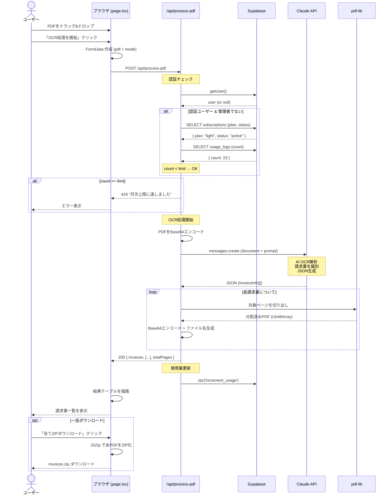
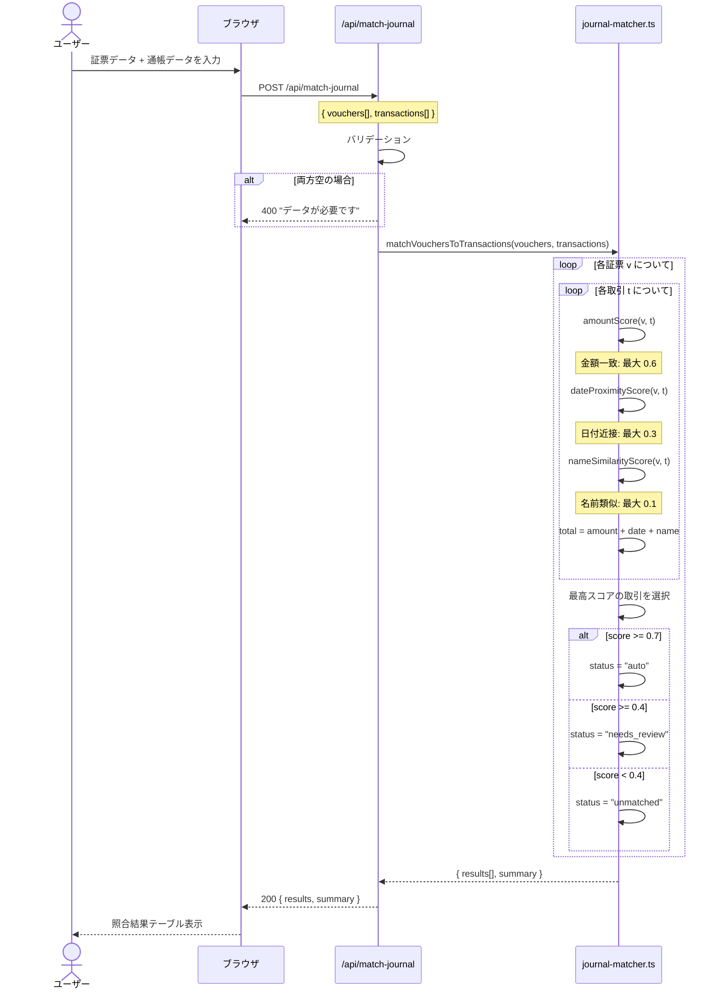
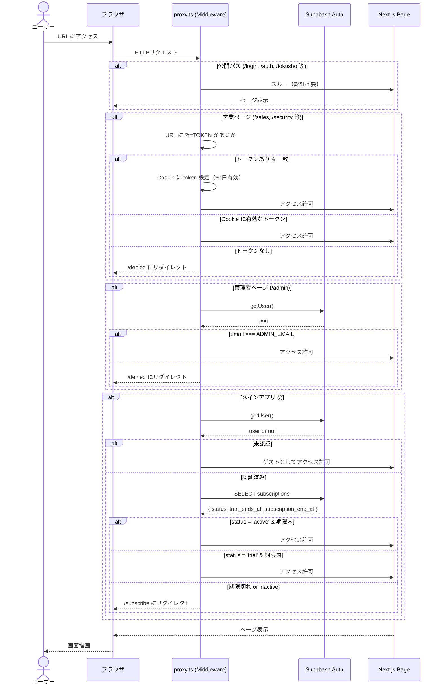

# 詳細設計書 — Invoice OCR

> クラス・関数単位の実装詳細

---

## 目次

1. [シーケンス図](#シーケンス図)
2. [型定義（lib/ocr/types.ts）](#型定義-libocrtypests)
3. [OCRエンジン群（lib/ocr/）](#ocrエンジン群-libocr)
4. [照合エンジン（lib/ocr/journal-matcher.ts）](#照合エンジン-libocrjournal-matcherts)
5. [API Routes（app/api/）](#api-routes-appapi)
6. [Supabaseクライアント（utils/supabase/）](#supabaseクライアント-utilssupabase)
7. [Middleware（proxy.ts）](#middleware-proxyts)
8. [フロントエンド（app/page.tsx）](#フロントエンド-apppagetsx)
8. [管理者ダッシュボード（app/admin/page.tsx）](#管理者ダッシュボード-appadminpagetsx)

---

## シーケンス図

### OCR処理フロー（メインフロー）



---

### 照合処理フロー



---

### 認証・Middleware フロー



---

## 型定義（lib/ocr/types.ts）

システム全体で使用する型定義ファイルです。

### `OcrMode`

```typescript
type OcrMode = 'invoice' | 'tax-return' | 'bank-statement';
```

- `invoice`：法人請求書モード
- `tax-return`：確定申告モード
- `bank-statement`：通帳モード

---

### `InvoiceInfo`（請求書情報）

```typescript
interface InvoiceInfo {
  pageStart: number;         // 請求書開始ページ（1始まり）
  pageEnd: number;           // 請求書終了ページ（1始まり）
  date: string;              // 請求日 (YYYYMMDD形式、不明時は"不明")
  requesterName: string;     // 請求元（発行者）の名称
  taxIncludedAmount: number | null;  // 税込合計金額（円）、読取不可時はnull
}
```

**例：**
```json
{
  "pageStart": 1,
  "pageEnd": 2,
  "date": "20260115",
  "requesterName": "株式会社サンプル",
  "taxIncludedAmount": 110000
}
```

---

### `InvoiceResult`（OCR処理後の請求書結果）

```typescript
interface InvoiceResult extends InvoiceInfo {
  index: number;        // 処理順序番号（1始まり）
  fileName: string;     // 生成されたファイル名（例: "001_20260115_株式会社サンプル_110000円.pdf"）
  pdfBase64: string;    // 分割済みPDFのBase64文字列
  sourceFile: string;   // 元のPDFファイル名
}
```

---

### `TaxReturnInfo`（確定申告情報）

```typescript
interface TaxReturnInfo {
  pageStart: number;
  pageEnd: number;
  year: string;              // 申告年度（例: "令和5年分", "2023"）
  taxpayerName: string;      // 納税者氏名
  documentType: string;      // 書類種別（例: "確定申告書B", "青色申告決算書"）
  totalIncome: number | null;      // 総所得金額（円）
  taxPayable: number | null;       // 納付税額（円）
}
```

---

### `BankTransaction`（通帳取引明細）

```typescript
interface BankTransaction {
  date: string;           // 取引日 (YYYYMMDD形式、不明時は"不明")
  description: string;   // 摘要・取引内容
  debit: number | null;  // 出金金額（円）
  credit: number | null; // 入金金額（円）
  balance: number | null; // 残高（円）
}
```

**例：**
```json
{
  "date": "20260110",
  "description": "ｶﾌﾞｼｷｶｲｼｬAAA 請求書支払",
  "debit": 110000,
  "credit": null,
  "balance": 2890000
}
```

---

### `BankStatementInfo`（通帳全体情報）

```typescript
interface BankStatementInfo {
  bankName: string;       // 銀行名（例: "三菱UFJ銀行"）
  accountNumber: string;  // 口座番号（通常は下4桁のみ表示）
  transactions: BankTransaction[];
}
```

---

### `JournalEntry`（自動仕訳エントリ）

```typescript
interface JournalEntry {
  date: string;           // 取引日 (YYYYMMDD)
  debitAccount: string;   // 借方勘定科目（例: "買掛金", "消耗品費"）
  creditAccount: string;  // 貸方勘定科目（例: "普通預金"）
  amount: number | null;  // 金額（円）
  description: string;   // 摘要
  taxType: string;        // 消費税区分（例: "課税仕入", "非課税", "対象外"）
}
```

---

### `OcrApiResponse<T>`（API共通レスポンス）

```typescript
interface OcrApiResponse<T> {
  items: T[];        // 処理済みアイテムの配列
  totalPages: number; // 元PDFの総ページ数
}
```

---

## OCRエンジン群（lib/ocr/）

### lib/ocr/invoice-ocr.ts

#### `processInvoicePdf(pdfBuffer, anthropic)`

請求書PDFを解析して個別請求書データの配列を返します。

```typescript
async function processInvoicePdf(
  pdfBuffer: Buffer,
  anthropic: Anthropic
): Promise<{ items: InvoiceResult[]; totalPages: number }>
```

**処理フロー：**

```
1. pdf-lib で PDF をロード → 総ページ数を取得
2. PDF全体をBase64エンコード
3. Anthropic API（claude-opus-4-6）に送信
   - document type: "application/pdf"
   - プロンプト: 請求書の識別・情報抽出を指示
4. JSONレスポンスをパース → InvoiceInfo[] に変換
5. 各請求書について pdf-lib でページを切り出し
6. 切り出しPDFをBase64エンコード
7. ファイル名を生成（sanitizeFileName() 経由）
8. InvoiceResult[] を返す
```

**Claude へのプロンプト（要約）：**
```
このPDFには複数の請求書が含まれています。
各請求書について以下をJSON配列で返してください：
- pageStart: 開始ページ番号（1始まり）
- pageEnd: 終了ページ番号（1始まり）
- date: 請求日（YYYYMMDD形式、不明なら"不明"）
- requesterName: 請求元名称
- taxIncludedAmount: 税込合計金額（数値、不明なら null）
```

**エラーハンドリング：**
- JSON解析失敗時：エラーをスローして上位で500エラーに変換
- ページ範囲が無効時：該当請求書をスキップ

---

#### `sanitizeFileName(name)`（lib/ocr/utils.ts より）

ファイル名として使用できない文字を除去・置換します。

```typescript
function sanitizeFileName(name: string): string
```

**変換ルール：**
- Windows/Mac で禁止の文字（`/ \ : * ? " < > |`）を全角または`_`に変換
- 先頭・末尾の空白を除去
- 連続するスペースを1つに集約
- 最大文字数：100文字でトリミング

**例：**
```typescript
sanitizeFileName('株式会社A/B商事')  // → '株式会社A／B商事'
sanitizeFileName('C:D*E?F')          // → 'C：D＊E？F'
```

---

### lib/ocr/tax-return-ocr.ts

#### `processTaxReturnPdf(pdfBuffer, anthropic)`

確定申告書類PDFを解析します。基本的な処理フローは `processInvoicePdf` と同じですが、抽出する情報が異なります。

```typescript
async function processTaxReturnPdf(
  pdfBuffer: Buffer,
  anthropic: Anthropic
): Promise<{ items: TaxReturnResult[]; totalPages: number }>
```

**Claude へのプロンプト（要約）：**
```
このPDFには確定申告書類が含まれています。
各書類について以下をJSON配列で返してください：
- pageStart / pageEnd
- year: 申告年度（例: "令和5年分"）
- taxpayerName: 納税者氏名
- documentType: 書類種別（確定申告書A/B、青色申告決算書 等）
- totalIncome: 総所得金額（数値、不明なら null）
- taxPayable: 納付税額（数値、不明なら null）
```

**ファイル名生成パターン：**
```
{連番3桁}_{年度}_{氏名}_{書類種別}.pdf
例: 001_令和5年分_山田太郎_確定申告書B.pdf
```

---

### lib/ocr/bank-statement-ocr.ts

#### `processBankStatementPdf(pdfBuffer, anthropic)`

通帳PDFから取引明細を抽出します。PDFの分割は行わず、取引データのみを返します。

```typescript
async function processBankStatementPdf(
  pdfBuffer: Buffer,
  anthropic: Anthropic
): Promise<{
  bankName: string;
  accountNumber: string;
  transactions: BankTransaction[];
  totalPages: number;
}>
```

**Claude へのプロンプト（要約）：**
```
この通帳PDFから以下をJSON形式で抽出してください：
- bankName: 銀行名
- accountNumber: 口座番号（部分的でも可）
- transactions: 取引明細の配列
  - date: 取引日（YYYYMMDD）
  - description: 摘要
  - debit: 出金（null可）
  - credit: 入金（null可）
  - balance: 残高（null可）
```

---

## 照合エンジン（lib/ocr/journal-matcher.ts）

請求書データ（証票）と通帳データ（入出金）を突合して、仕訳候補を生成するエンジンです。

### 主要な型定義

```typescript
type VoucherInput = {
  id: string;
  date: string;           // YYYYMMDD
  vendorName: string;     // 相手先名
  amount: number;         // 税込金額
};

type TransactionInput = {
  id: string;
  date: string;           // YYYYMMDD
  description: string;   // 摘要
  debit: number | null;  // 出金
  credit: number | null; // 入金
};

type MatchResult = {
  voucherId: string;
  transactionId: string | null;
  score: number;          // 0.0 〜 1.0
  status: 'auto' | 'needs_review' | 'unmatched';
  scoreDetail: {
    amount: number;       // 金額スコア（0〜0.6）
    date: number;         // 日付スコア（0〜0.3）
    name: number;         // 名前スコア（0〜0.1）
  };
};

type MatchSummary = {
  total: number;
  auto: number;
  needs_review: number;
  unmatched: number;
};
```

---

### `matchVouchersToTransactions(vouchers, transactions)`

証票リストと入出金リストを照合して結果を返す主関数。

```typescript
function matchVouchersToTransactions(
  vouchers: VoucherInput[],
  transactions: TransactionInput[]
): { results: MatchResult[]; summary: MatchSummary }
```

**アルゴリズム：**

```
各証票 v について:
  1. 全取引 t に対してスコアを計算
  2. スコア最大の取引を候補として選定
  3. 閾値に基づいてステータスを決定:
     - score ≥ 0.7 → 'auto'（自動照合）
     - score ≥ 0.4 → 'needs_review'（要確認）
     - score < 0.4 → 'unmatched'（未照合）
  4. 1対1照合のため、使用済み取引は候補から除外（greedy algorithm）

サマリー集計:
  - auto / needs_review / unmatched の件数を集計
```

---

### `amountScore(voucher, transaction)` （内部関数）

金額の一致度スコアを計算します（最大0.6）。

```typescript
function amountScore(v: VoucherInput, t: TransactionInput): number
```

**ロジック：**
- `v.amount === t.debit` → 完全一致 → **0.60**
- `v.amount === t.credit` → 完全一致 → **0.60**
- 10%以内の誤差 → **0.40**（端数丸めのズレを考慮）
- それ以外 → **0.00**

---

### `dateProximityScore(voucher, transaction)` （内部関数）

日付の近接度スコアを計算します（最大0.3）。

```typescript
function dateProximityScore(v: VoucherInput, t: TransactionInput): number
```

**ロジック：**
| 日付差 | スコア | 理由 |
|--------|--------|------|
| 0日 | 0.30 | 完全一致 |
| 1〜3日 | 0.20 | 当日前後 |
| 4〜7日 | 0.10 | 1週間以内 |
| 8〜30日 | 0.05 | 月内 |
| 31日以上 | 0.00 | 月をまたぐ |

---

### `nameSimilarityScore(voucher, transaction)` （内部関数）

相手先名の類似度スコアを計算します（最大0.1）。

```typescript
function nameSimilarityScore(v: VoucherInput, t: TransactionInput): number
```

**ロジック：**
1. `normalizeVendorName()` で両者を正規化
2. 正規化後の名前が一方に含まれていれば → **0.10**
3. 先頭4文字が一致すれば → **0.05**
4. それ以外 → **0.00**

---

### `normalizeVendorName(name)` （内部関数）

相手先名を照合しやすい形式に正規化します。

```typescript
function normalizeVendorName(name: string): string
```

**変換内容：**
- 全角→半角変換（英数字・記号）
- カタカナの半角→全角変換
- 法人格表記の除去（株式会社、（株）、㈱、有限会社 等）
- 空白除去
- 小文字化

**例：**
```typescript
normalizeVendorName('株式会社サンプル')  // → 'さんぷる'
normalizeVendorName('ｶﾌﾞｼｷｶｲｼｬAAA') // → 'ａａａ'
```

---

## API Routes（app/api/）

### app/api/process-pdf/route.ts

**ファイルレベルの設定：**
```typescript
export const maxDuration = 60;  // Vercel関数タイムアウト（秒）
```

#### `POST /api/process-pdf`

詳細は [API仕様書](./API仕様書.md) を参照してください。

**内部処理の詳細：**

```typescript
// プラン別の月次上限件数
const PLAN_LIMITS: Record<string, number> = {
  light: 50,    // ライトプラン
  heavy: 200,   // ヘビープラン
  trial: 50,    // トライアル
};
```

**使用量チェックのロジック：**
```
1. Supabase Auth でユーザー認証状態を確認
2. 管理者（ADMIN_EMAIL）は上限チェックをスキップ
3. subscriptions テーブルからプラン・ステータスを取得
4. status === 'active' の場合は plan の上限を使用
5. それ以外（trial）は trial の上限（50件）を使用
6. usage_logs から当月の使用数を取得
7. 使用数 ≥ 上限 の場合 429 エラーを返す
```

**モード分岐：**
```typescript
if (mode === 'tax-return') {
  // → processTaxReturnPdf() を呼び出し
} else if (mode === 'bank-statement') {
  // → processBankStatementPdf() を呼び出し
} else {
  // → processInvoicePdf() を呼び出し（デフォルト）
}
```

**使用量インクリメント：**
```typescript
// OCR成功後のみカウントアップ
// サービスクライアント（RLSバイパス）を使用
await service.rpc('increment_usage', {
  p_user_id: userId,
  p_year_month: yearMonth   // 例: '2026-04'
});
```

---

### app/api/match-journal/route.ts

```typescript
export const maxDuration = 30;  // 照合処理は短時間で完了する想定
```

#### `POST /api/match-journal`

**入力バリデーション：**
```typescript
// vouchers と transactions が両方空の場合はエラー
if (vouchers.length === 0 && transactions.length === 0) {
  return 400;
}
// 一方が空でも処理は継続（片方のみアップロードのユースケースを考慮）
```

---

### app/api/usage/route.ts

#### `GET /api/usage`

**認証必須**（未認証時は401）。

**レスポンス例：**
```json
{
  "count": 23,
  "limit": 50,
  "plan": "light",
  "status": "active",
  "yearMonth": "2026-04"
}
```

---

### app/api/admin/subscriptions/route.ts

#### `verifyAdmin()` （内部関数）

管理者認証を確認するヘルパー関数。

```typescript
async function verifyAdmin(): Promise<User | null>
```

- Supabase Auth でセッション確認
- `user.email === process.env.ADMIN_EMAIL` を検証
- 管理者でない場合は `null` を返す

#### `GET /api/admin/subscriptions`

全サブスクリプション一覧を返します。サービスクライアント（RLSバイパス）を使用して全ユーザーのデータを取得します。

**内部結合ロジック：**
```typescript
// usage_logs を Map に変換して O(1) で参照
const usageMap = new Map(usageLogs.map(u => [u.user_id, u.count]));
// subscriptions に今月の使用量を結合
subscriptions = data.map(s => ({
  ...s,
  monthly_usage: usageMap.get(s.user_id) ?? 0,
}));
```

#### `PATCH /api/admin/subscriptions`

アクション別の処理：

| action | 処理内容 |
|--------|---------|
| `activate` | status='active'、開始日=現在、終了日=2ヶ月後 |
| `extend` | 終了日を現在の終了日から2ヶ月延長（未設定の場合は現在から2ヶ月） |
| `deactivate` | status='inactive' |

---

## Supabaseクライアント（utils/supabase/）

### utils/supabase/client.ts

ブラウザ（クライアントコンポーネント）で使用するSupabaseクライアント。

```typescript
export function createClient(): SupabaseBrowserClient
```

- `createBrowserClient` を使用（Cookie自動管理）
- AnonymousKeyを使用（Row Level Security が適用される）

### utils/supabase/server.ts

サーバーコンポーネント・API Routeで使用するSupabaseクライアント。

```typescript
export async function createClient(): Promise<SupabaseServerClient>
```

- `createServerClient` を使用（Next.js cookies() と連携）
- セッションCookieを読み書きして認証状態を維持

### utils/supabase/service.ts

管理者操作・バックエンド処理でRLSをバイパスするためのクライアント。

```typescript
export function createServiceClient(): SupabaseClient
```

- `SUPABASE_SERVICE_ROLE_KEY` を使用
- Row Level Security を完全にバイパス
- **サーバーサイドのみで使用すること（クライアントに漏洩させない）**

---

## Middleware（proxy.ts）

Next.js Middlewareとして機能し、全リクエストに対して認証・認可を行います。

### ルーティングルール

```typescript
export const config = {
  matcher: [
    '/((?!_next/static|_next/image|favicon.ico|.*\\.png$).*)',
  ],
};
```

### 処理フロー

```
リクエスト受信
│
├─ 公開パス（/login, /auth, /subscribe, /tokusho, /denied）
│    → スルー（認証チェックなし）
│
├─ 営業ページ（/sales, /security, /guide, /faq, /pricing）
│    ├─ URLクエリに ?t=SALES_TOKEN が含まれるか確認
│    │    → あり: Cookie に token を設定（30日有効） → アクセス許可
│    ├─ Cookie に有効な token があるか確認
│    │    → あり: アクセス許可
│    └─ なし → /denied にリダイレクト
│
├─ 管理者ページ（/admin）
│    ├─ Supabase Auth でセッション確認
│    ├─ 未認証 → /login にリダイレクト
│    └─ email ≠ ADMIN_EMAIL → /denied にリダイレクト
│
└─ その他（メインアプリ）
     ├─ Supabase Auth でセッション確認
     ├─ 未認証 → スルー（ゲストとして使用可能）
     ├─ 認証済み → subscription を確認
     │    ├─ status === 'trial'
     │    │    → trial_ends_at を確認
     │    │    → 期限切れ → /subscribe にリダイレクト
     │    ├─ status === 'active'
     │    │    → subscription_end_at を確認
     │    │    → 期限切れ → /subscribe にリダイレクト
     │    └─ status === 'inactive' → /subscribe にリダイレクト
     └─ アクセス許可
```

---

## フロントエンド（app/page.tsx）

メインアプリケーションUIです（約1,716行）。

### State管理

```typescript
// モード選択
const [mode, setMode] = useState<OcrMode>('invoice');

// ファイル管理
const [files, setFiles] = useState<File[]>([]);
const [isDragging, setIsDragging] = useState(false);

// 処理状態
const [isProcessing, setIsProcessing] = useState(false);
const [progress, setProgress] = useState({ current: 0, total: 0 });

// OCR結果
const [invoiceResults, setInvoiceResults] = useState<InvoiceResult[]>([]);
const [taxReturnResults, setTaxReturnResults] = useState<TaxReturnResult[]>([]);
const [bankResults, setBankResults] = useState<BankTransaction[]>([]);
const [bankInfo, setBankInfo] = useState<{ bankName: string; accountNumber: string } | null>(null);

// エラー管理
const [error, setError] = useState<string | null>(null);

// ゲスト使用量
const [guestCount, setGuestCount] = useState<number>(0);
const GUEST_MAX_USES = 5;

// 認証状態
const [user, setUser] = useState<User | null>(null);
const [usageInfo, setUsageInfo] = useState<UsageInfo | null>(null);
```

---

### 主要関数

#### `handleFileSelect(files: FileList | File[])`

ファイル選択時の処理。

```typescript
function handleFileSelect(files: FileList | File[]): void
```

- PDFファイルのみフィルタリング
- 重複ファイルの除外（ファイル名 + サイズで判定）
- `setFiles()` で状態更新

---

#### `handleDrop(e: DragEvent)`

ドラッグ&ドロップ時のイベントハンドラー。

```typescript
function handleDrop(e: React.DragEvent<HTMLDivElement>): void
```

- `e.preventDefault()` でデフォルト動作を防止
- `e.dataTransfer.files` を `handleFileSelect()` に渡す

---

#### `handleProcess()`

OCR処理を開始するメイン関数。

```typescript
async function handleProcess(): Promise<void>
```

**処理フロー：**
```
1. ゲストの場合: guestCount >= GUEST_MAX_USES → エラー表示
2. 認証ユーザーの場合: usageInfo.count >= usageInfo.limit → エラー表示
3. files.length === 0 → エラー表示
4. progress を初期化（total = files.length）
5. 各ファイルについて順番に処理:
   a. FormData を作成（pdf + mode）
   b. /api/process-pdf に POST
   c. レスポンスに応じて invoiceResults / taxReturnResults / bankResults を更新
   d. progress.current をインクリメント
6. ゲストの場合: guestCount を localStorage に保存・インクリメント
7. 認証ユーザーの場合: fetchUsage() で使用量を再取得
```

---

#### `base64ToBlob(base64, mimeType)`

Base64文字列をBlobに変換するユーティリティ。

```typescript
function base64ToBlob(base64: string, mimeType: string): Blob
```

**処理：**
```typescript
const byteCharacters = atob(base64);
const byteArray = new Uint8Array(byteCharacters.length);
// ... バイト変換 ...
return new Blob([byteArray], { type: mimeType });
```

---

#### `downloadBlob(blob, fileName)`

Blobをブラウザでダウンロードさせるユーティリティ。

```typescript
function downloadBlob(blob: Blob, fileName: string): void
```

**処理：**
```typescript
const url = URL.createObjectURL(blob);
const a = document.createElement('a');
a.href = url;
a.download = fileName;
a.click();
URL.revokeObjectURL(url);  // メモリリーク防止
```

---

#### `downloadAllAsZip()`

全結果をZIPにまとめてダウンロードする関数。

```typescript
async function downloadAllAsZip(): Promise<void>
```

**処理：**
```typescript
const zip = new JSZip();
for (const result of invoiceResults) {
  const blob = base64ToBlob(result.pdfBase64, 'application/pdf');
  zip.file(result.fileName, blob);
}
const zipBlob = await zip.generateAsync({ type: 'blob' });
downloadBlob(zipBlob, 'invoices.zip');
```

---

#### `downloadCsv()`

通帳取引データをCSV形式でダウンロード。

```typescript
function downloadCsv(): void
```

**CSVフォーマット：**
```csv
日付,摘要,出金,入金,残高
20260110,ｶﾌﾞｼｷｶｲｼｬAAA 請求書支払,110000,,2890000
20260115,給与振込,,500000,3390000
```

---

### サブコンポーネント

#### `InvoiceRow({ result })`

請求書一覧の1行を表示するコンポーネント。

```typescript
function InvoiceRow({ result }: { result: InvoiceResult }): JSX.Element
```

**表示内容：**
- 番号（index）
- 元ファイル名（sourceFile）
- 日付（date：YYYYMMDD → YYYY/MM/DD に整形）
- 請求元名（requesterName）
- 税込金額（taxIncludedAmount：`¥110,000` 形式）
- 個別ダウンロードボタン

---

#### `TaxReturnRow({ result })`

確定申告書類一覧の1行を表示するコンポーネント。

```typescript
function TaxReturnRow({ result }: { result: TaxReturnResult }): JSX.Element
```

**表示内容：**
- 番号・申告年度・納税者名・書類種別・総所得・納付税額・ダウンロード

---

#### `BankRow({ transaction })`

通帳取引明細の1行を表示するコンポーネント。

```typescript
function BankRow({ transaction }: { transaction: BankTransaction }): JSX.Element
```

**表示内容：**
- 日付・摘要・出金・入金・残高

---

## 管理者ダッシュボード（app/admin/page.tsx）

### State管理

```typescript
const [subscriptions, setSubscriptions] = useState<SubscriptionRow[]>([]);
const [isLoading, setIsLoading] = useState(true);
const [actionLoading, setActionLoading] = useState<string | null>(null);  // 処理中のサブスクID

// サマリー（計算値）
const summary = useMemo(() => ({
  trial: subscriptions.filter(s => s.status === 'trial').length,
  active: subscriptions.filter(s => s.status === 'active').length,
  pending: subscriptions.filter(s => s.status === 'pending').length,
  inactive: subscriptions.filter(s => s.status === 'inactive').length,
}), [subscriptions]);
```

---

### 主要関数

#### `fetchSubscriptions()`

管理者API からサブスクリプション一覧を取得。

```typescript
async function fetchSubscriptions(): Promise<void>
```

---

#### `handleAction(id, action)`

サブスクリプションアクション実行。

```typescript
async function handleAction(
  id: string,
  action: 'activate' | 'extend' | 'deactivate'
): Promise<void>
```

- PATCH `/api/admin/subscriptions` を呼び出す
- 成功後に `fetchSubscriptions()` で一覧を再取得
- 処理中は該当行のボタンをローディング表示

---

### `SubscriptionRow` 型

```typescript
type SubscriptionRow = {
  id: string;
  user_id: string;
  email: string;
  plan: 'light' | 'heavy';
  status: 'trial' | 'active' | 'pending' | 'inactive';
  payment_method: 'bank_transfer' | 'stripe';
  trial_ends_at: string | null;      // ISO8601
  subscription_start_at: string | null;
  subscription_end_at: string | null;
  created_at: string;
  monthly_usage: number;             // 今月の処理件数（APIが結合）
};
```
